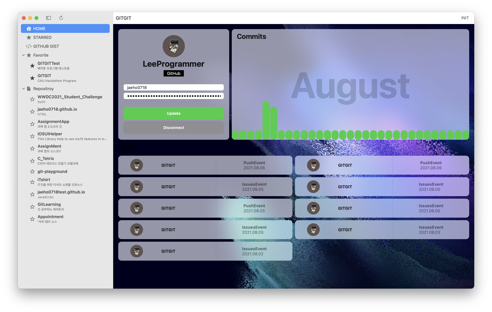
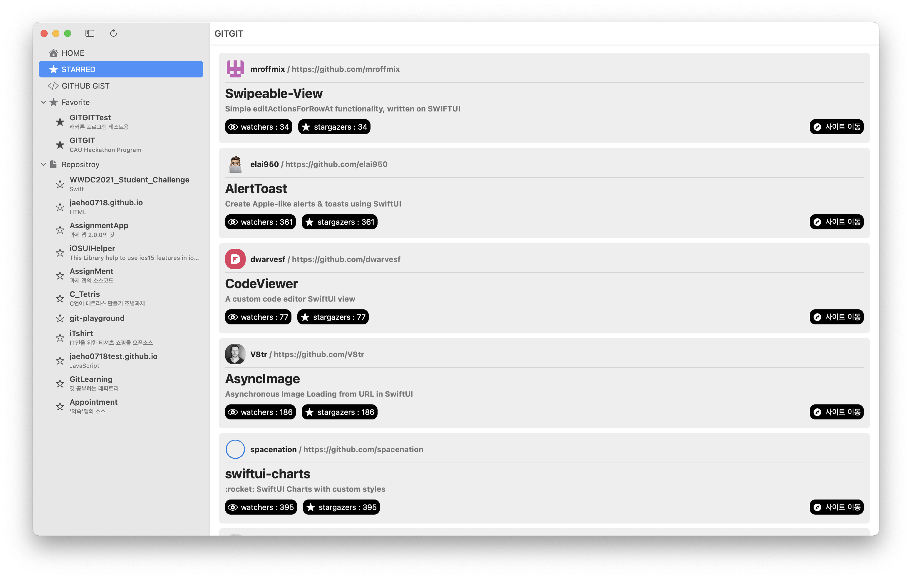
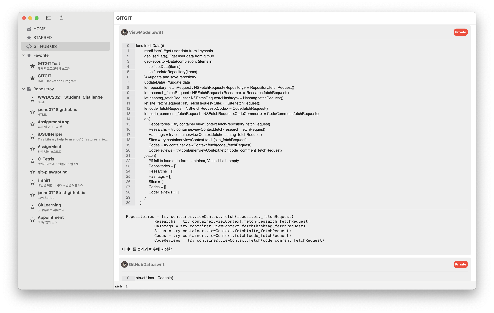
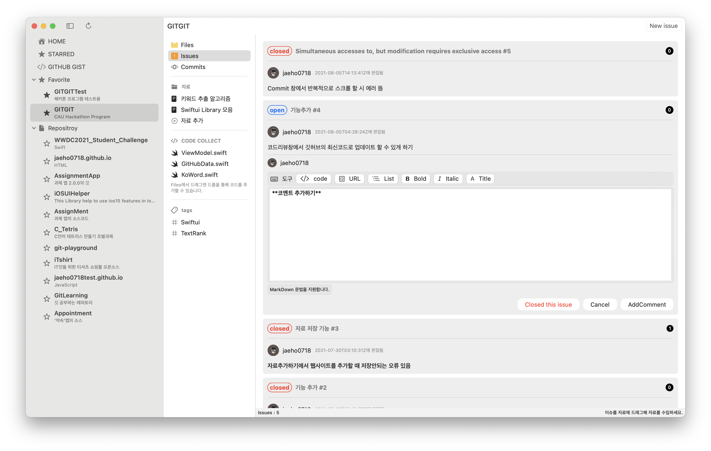
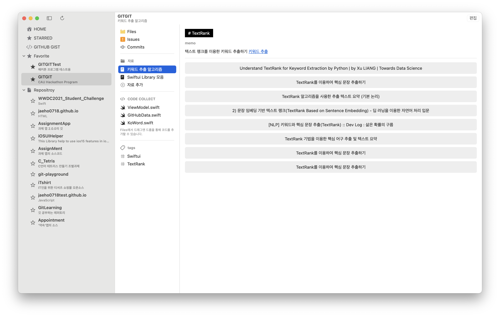
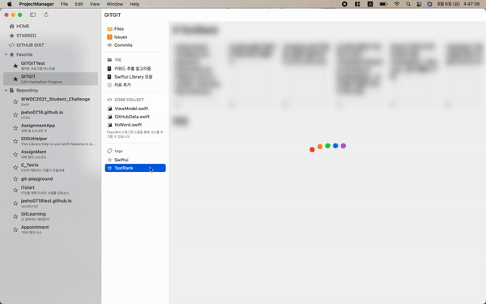
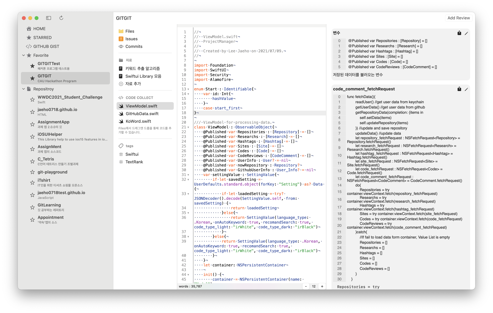

# GITGIT
----------
CAU Hackathon Program

## GITGIT을 통해 프로젝트를 관리하세요.

## WHY?

여러개의 프로젝트를 진행하면서 각 프로젝트에 필요한 자료를 모으고 정리해야할 프로그램이 필요하여 만들게 되었습니다.
GITGIT은 다음 기능을 제공합니다.

+ 기능들
    + GITHUB 연동
    + 자료 정리

## GITHUB 연동

왜 깃허브 연동을 기능으로 넣었을까요? GITHUB는 가장 많이 사용되는 깃 원격 저장소입니다. 또한 GITHUB는 다양한 기능들을 제공합니다. GITGIT은 이러한 GITHUB의 장점들을 이용합니다.

### 오늘 커밋은?

 이번달 커밋 그래프와 최근 이벤트들을 보여드립니다.  사용자가 원하는 이미지를 찾아 배경으로 설정할 수 있습니다.

### 내 Starred

내가 STAR를 누른 레파토리를 확인하세요.

### 코드 모음

내가 올린 GIST들을 확인하세요. GITGIT의 코드 모음 기능으로 GIST에 업로드 할 수 있습니다.

### 이슈 확인

각 레퍼토리에서 이슈를 확인하세요. 이슈 등록과 코멘트를 달 수 있습니다.

## 자료 수집

GITGIT은 각 레퍼토리별로 자료를 수집하고 정리하도록 도와줍니다.

### 자료 척척

필요한 기능에 따라 자료를 수집하고 정리하세요. 드래그앤 드롭으로 필요한 자료 사이트를 쉽게 추가할 수 있습니다. GITGIT은 사이트 추가 뿐 아니라 요약까지 해주죠. 마크다운 문법을 지원함으로써 코드를 추가하거나 URL,리스트등을 추가할 수 있죠. 태그 기능을 통해 태그별로 자료를 볼 수 있어요.

### 태그 태그

  

태그 별로 자료를 정리해드립니다. 그 뿐만 아니라 각 태그에 적합한 코드를 깃허브에서 찾아주죠. 사용자는 그저 코드를 확인하고 CodeCollect에 드래그해 추가하면 됩니다. 또한 코드를 다운받을 수 있습니다.

### 코드 수집

 Files에서 코드를 드래그앤드롭하여 추가하고, 코드별로 정리하세요. 정리한 코드는 바로 GIST에 업로드할 수 있습니다.

